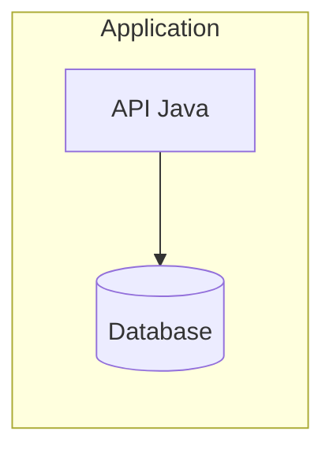

[JAVA_BADGE]:https://img.shields.io/badge/java-%23ED8B00.svg?style=for-the-badge&logo=openjdk&logoColor=white
[SPRING_BADGE]: https://img.shields.io/badge/spring-%236DB33F.svg?style=for-the-badge&logo=spring&logoColor=white
[POSTGRESQL_BADGE]:https://img.shields.io/badge/postgres-%23316192.svg?style=for-the-badge&logo=postgresql&logoColor=white
[AWS_BADGE]:https://img.shields.io/badge/AWS-%23FF9900.svg?style=for-the-badge&logo=amazon-aws&logoColor=white
[LICENSE_BADGE]: https://img.shields.io/github/license/Ileriayo/markdown-badges?style=for-the-badge


<h1 align="center" style="font-weight: bold;">Banco Javer - Itaú/IBM 💻</h1>

![java][JAVA_BADGE]
![spring][SPRING_BADGE]
![postgresql][POSTGRESQL_BADGE]
![aws][AWS_BADGE]
![license][LICENSE_BADGE]

Este projeto consiste em uma API desenvolvida com **Java**, utilizando o framework **Java Spring** e o **banco de dados postgreSQL.**

Foi realizado os testes unitários no formato Given-When-Then (GWT), utilizando as bibliotecas **JUnit, Mockito e AssertJ.**

Este projeto foi desenvolvido como avaliação final da trilha de Java do projeto Itaú/IBM.

## Índice

- [Instalação](#instalação)
- [Configurações](#configurações)
- [Usando](#usando)
- [API Endpoints](#api-endpoints)
- [Banco de Dados](#banco-de-dados)

## Instalação

## Configurações

## Usando

## Arquitetura

O projeto segue uma arquitetura simples com Docker.



## API Endpoints
A API fornece os seguintes endpoints:

**POST USERS**

```text
POST /users - Registra um novo usuário no banco
```

```json
{
    "name": "Clint Eastwood",
    "cpf": "12345678910",
    "telefone": "11916725678",
    "correntista": true,
    "saldo_cc": 1000.0
}
```

**GET USERS**

```text
GET /users - Recupera uma lista de todos os usuários, mostrando seu ID e nome.
```

```json
[
    {
      "id": 1,
      "name": ""
    },
    {
        "id": 2,
        "name": ""
    }
]
```

```text
GET /users/{id} - Recupera uma lista de um usuário a partir de seu ID, mostrando todos os seus dados do DB.
```

```json
[
    {
      "id": 1,
      "name": "",
      "cpf": "12345678910",
      "telefone": "11916725678",
      "correntista": true,
      "score_credito": 0.00,
      "saldo_cc": 1000.0
      
    },
    {
      "id": 2,
      "name": "",
      "cpf": "12345678910",
      "telefone": "11916725678",
      "correntista": false,
      "score_credito": 0.00,
      "saldo_cc": 1000.0
    }
]
```

**DELETE USERS**

```text

DEL /users/{id} - Delete um usuário do banco a partir de seu ID.
```

```json
{
    "id": 1,
    "name": "Clint Eastwood",
    "cpf": "12345678910",
    "telefone": "11916725678",
    "correntista": true,
    "socre_credito": 0.00,
    "saldo_cc": 1000.0
}
```

**UPDATE USERS**

```text
PUT /users - Atualiza os dados nome, telefone e correntista de um usuário a partir de seu CPF.
```

```json
{
    "name": "Clint Eastwood",
    "cpf": "12345678910",
    "telefone": "11916725678",
    "correntista": true
}
```

```text
PACTH /users/{cpf}/score-credito - Atualiza o score de crédito do usuário em 10% do saldo disponível.
```

## Banco de Dados

O projeto utiliza [postgreSQL](https://www.postgresql.org/about/) como um banco de dados.
